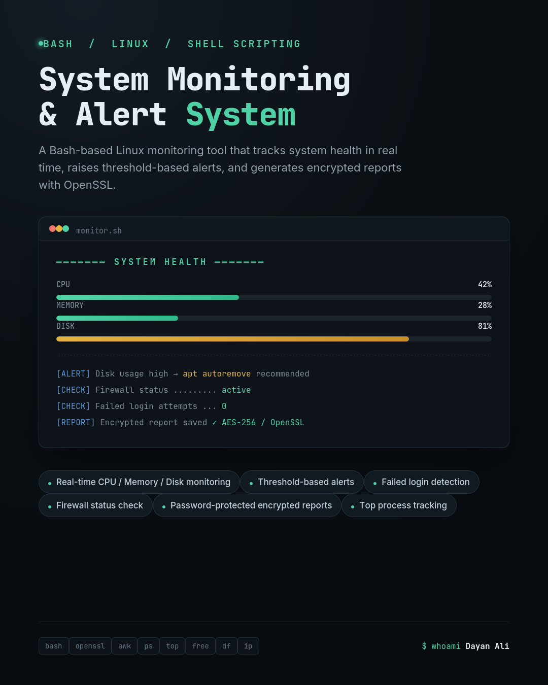

# System Monitoring & Alert System

## Overview

The System Monitoring & Alert System is a Bash-based Linux application that monitors important system resources such as CPU, memory, disk usage, network information, and security status. It provides real-time system health information, generates alerts when resource usage exceeds predefined thresholds, and allows users to create password-protected encrypted reports.

## Features

- CPU usage monitoring
- Memory usage monitoring
- Disk usage monitoring
- System load average
- Network IP detection
- Logged-in user monitoring
- Firewall status checking
- Failed login detection
- Top CPU-consuming processes
- Top memory-consuming processes
- Threshold-based alerts
- Encrypted report generation using OpenSSL

## Technologies Used

- Bash
- Linux
- OpenSSL
- System utilities (top, free, df, ps, ip)

## How to Run

Make the script executable:

```bash
chmod +x script.sh
```

Run the monitor:

```bash
./script.sh
```

Generate an encrypted report:

```bash
./script.sh --report
```

View an encrypted report:

```bash
./script.sh --view report.enc
```

## Future Improvements

- Email notifications
- Web dashboard
- Historical performance graphs
- AI-based anomaly detection
